### 📚 ACTIVIDAD 04

### EJERCICIOS DE LEETCODE UTILIZANDO JAVASCRIPT

### 💻 EJERCICIO 1: TWO SUM

🟢 Resultado:

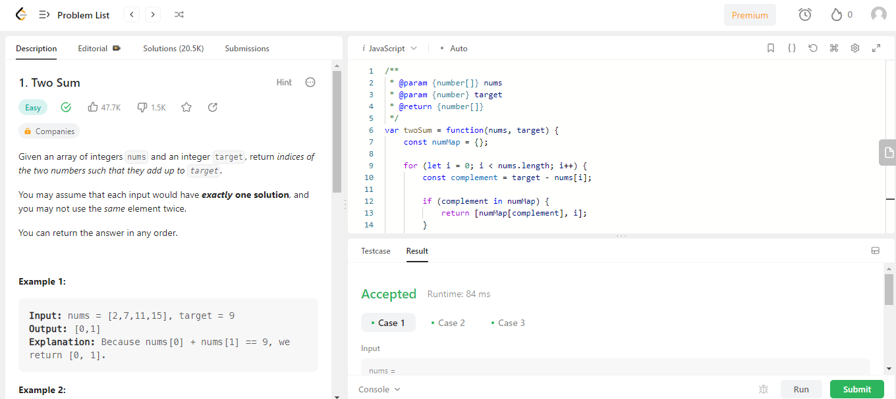

✅ Aceptado:

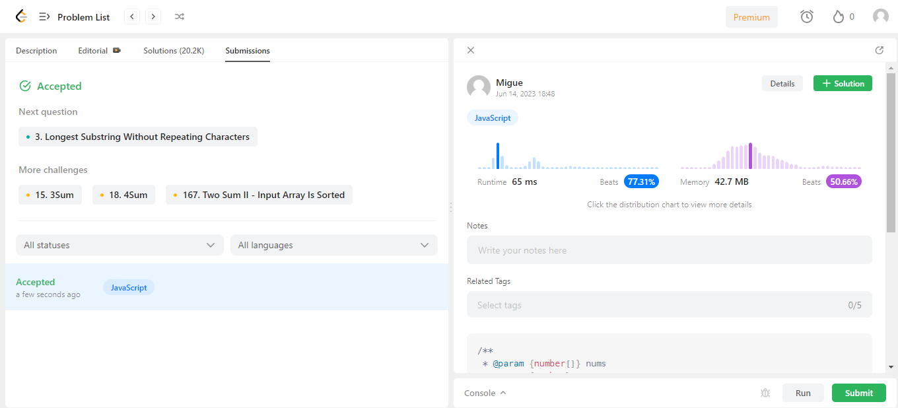

### 💻 EJERCICIO 2: PALINDROME NUMBER

🟢 Resultado:

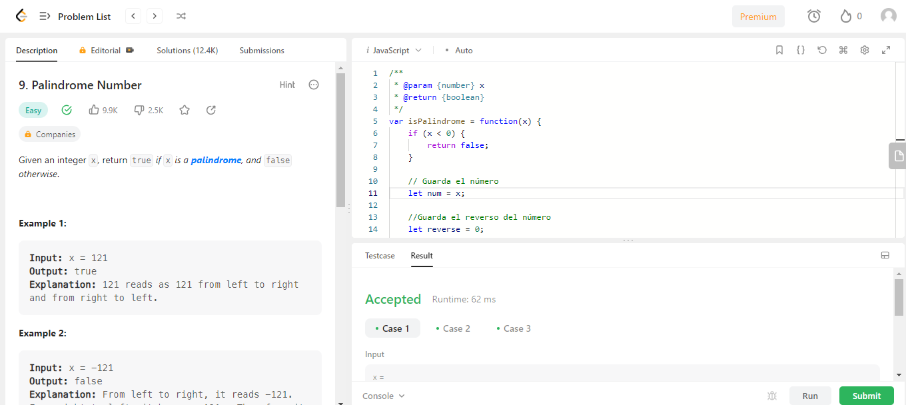

✅ Aceptado:

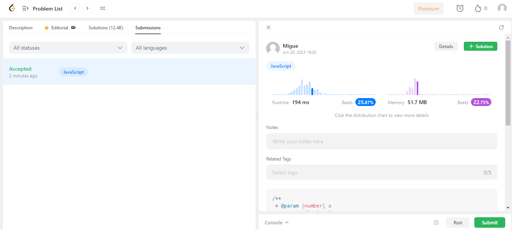

### 💻 EJERCICIO 3: ROMAN TO INTEGER

🟢 Resultado:

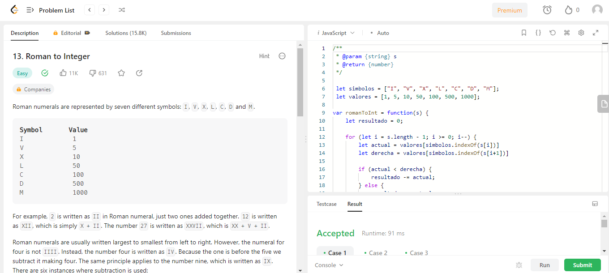

✅ Aceptado:

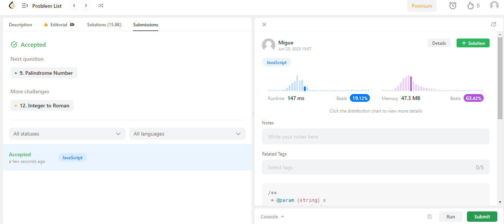

### 💻 EJERCICIO 4: LENGTH OF LAST WORD

🟢 Resultado:

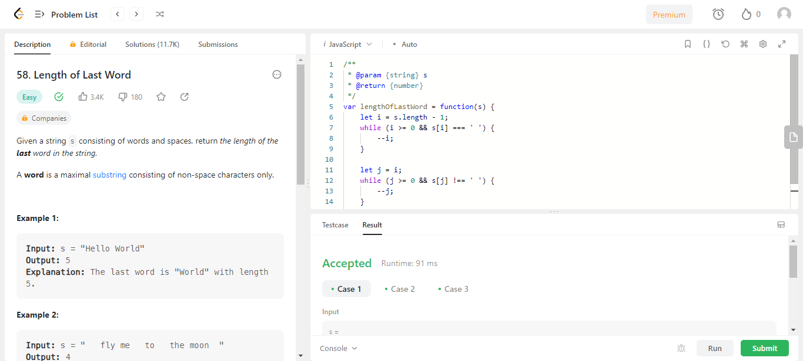

✅ Aceptado:

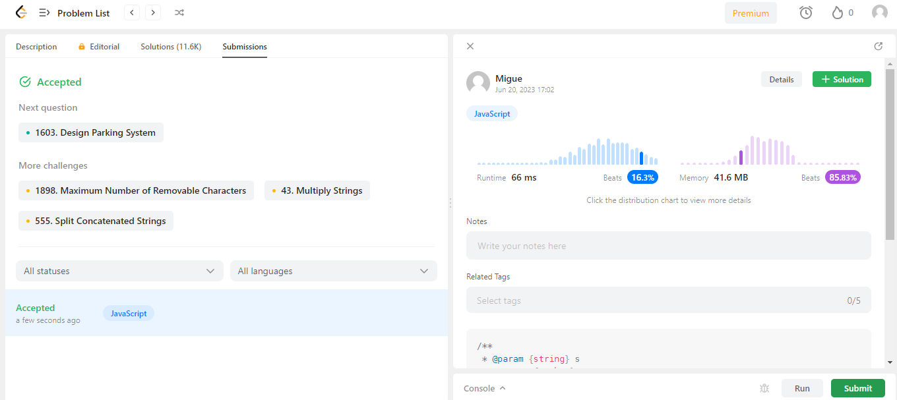

### 💻 EJERCICIO 5: PLUS ONE

🟢 Resultado:

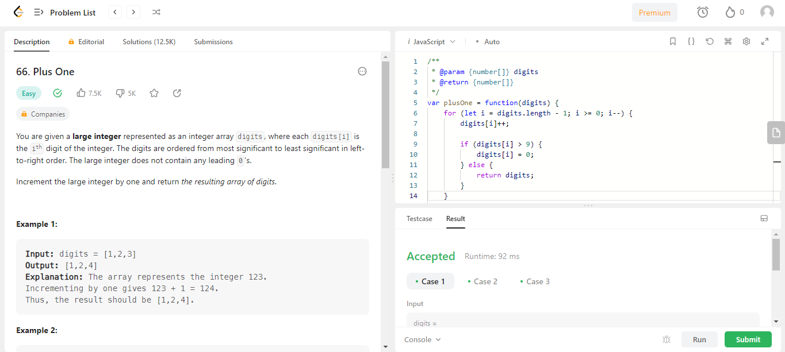

✅ Aceptado:

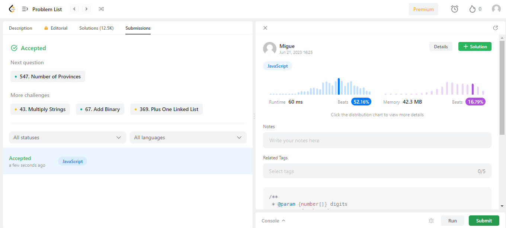

### 💻 EJERCICIO 6: SINGLE NUMBER

🟢 Resultado:

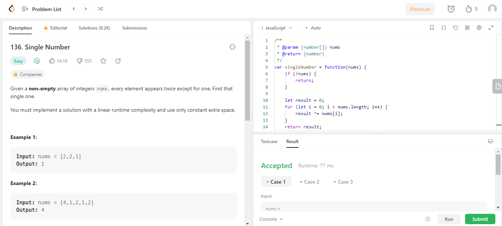

✅ Aceptado:

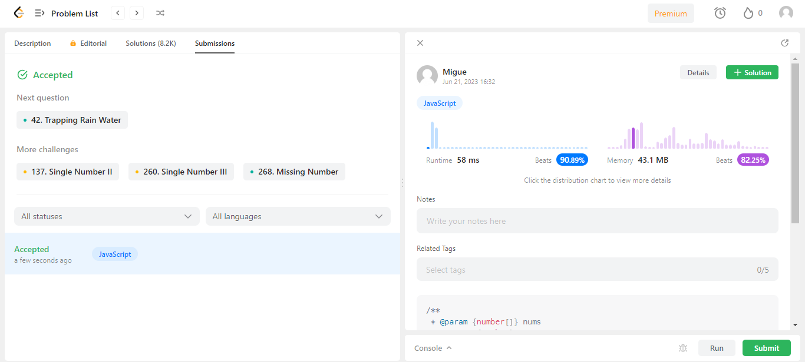
